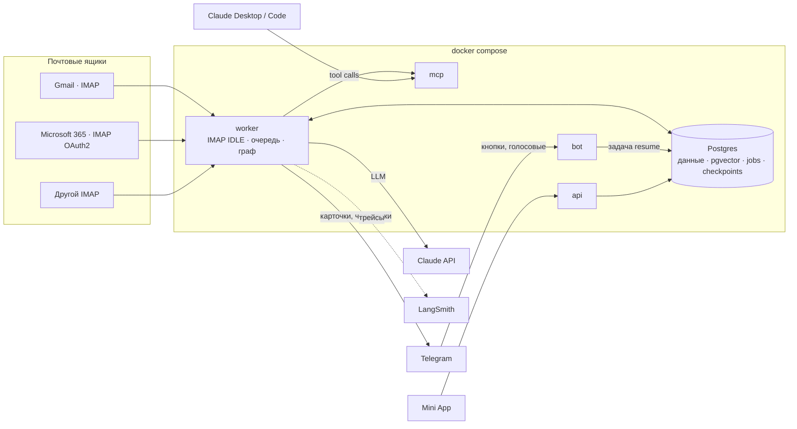
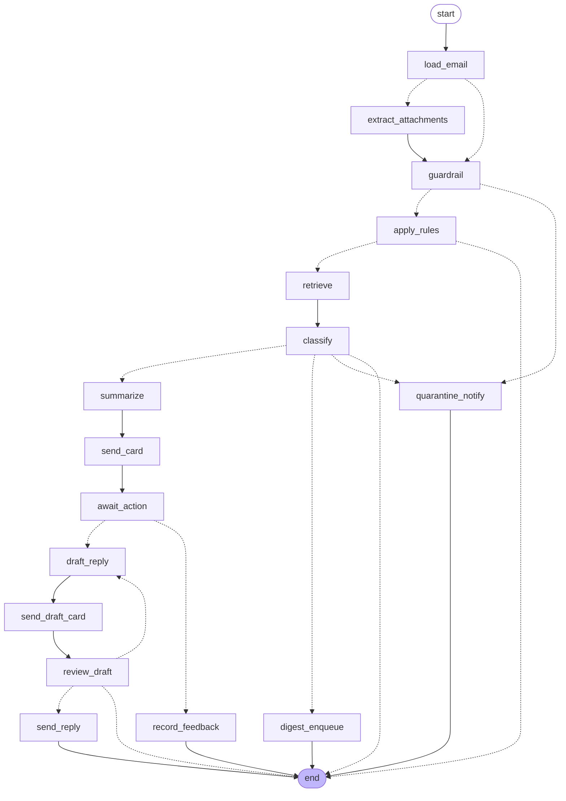

# Архитектура MailPulse

## Компоненты

| Процесс | Отвечает за |
|---|---|
| `worker` | слушает ящики, выполняет задачи из очереди, запускает и возобновляет граф |
| `bot` | принимает нажатия и голосовые, превращает их в задачи; сам LLM не вызывает |
| `mcp` | tool'ы почты для своего агента и для Claude Desktop / Code |
| `api` | бэкенд Mini App, OAuth callback Microsoft |
| `migrate` | миграции Alembic и таблицы чекпоинтера, запускается до остальных |

## Путь одного письма

1. `worker` держит IMAP IDLE. Пришёл новый UID → письмо сохраняется в `messages`, в той же транзакции ставится задача `process_email`.
2. Воркер берёт задачу (`FOR UPDATE SKIP LOCKED`) и запускает граф с `thread_id = email-{id}`.
3. Граф проходит проверки и классификацию. Для важного письма отправляет карточку и встаёт на `interrupt()`; состояние сохраняется в Postgres.
4. Пользователь нажимает кнопку → `bot` ставит задачу `resume_email` с ответом.
5. Воркер возобновляет граф: `Command(resume=…)` с тем же `thread_id`.
6. Черновик отправляется только после «Отправить»: узел `review_draft` помечает его одобренным, `send_draft` без одобрения откажет.

## Граф обработки письма

Сгенерировано из кода: `make graph` → `docs/graph.mmd`. Пунктир — условные переходы.

| Механизм | Где |
|---|---|
| Ветвления | `load_email` (есть ли вложения), `guardrail` (подозрительное), `apply_rules` (заглушённый отправитель), `classify` (4 исхода), `await_action`, `review_draft` |
| Цикл | `draft_reply → send_draft_card → review_draft → draft_reply`, не больше 3 итераций |
| Human-in-the-loop | `await_action` (кнопки карточки), `review_draft` (Отправить / Изменить / Отмена) |

Отправка сообщения и ожидание ответа — всегда разные узлы: после resume узел с `interrupt()` выполняется заново с начала, и отправка в том же узле продублировала бы сообщение. Это проверяет тест `test_card_is_sent_once_across_resume`.

## Порты: что заменяется без изменения графа

Узлы получают зависимости через `AgentDeps` (контекст выполнения LangGraph), а не импортируют реализации. Файл: `src/mailpulse/agent/ports.py`.

| Порт | Реализация в работе | Кандидаты для A/B |
|---|---|---|
| `Classifier` | Claude Haiku 4.5, structured output | Sonnet 5 |
| `Summarizer` | Claude Sonnet 5 | effort low / medium |
| `Drafter` | Claude Sonnet 5 или Opus 5 | по итогам A/B |
| `Extractor` | текстовый слой PDF/DOCX, vision для сканов | Tesseract + текстовая модель |
| `Retriever` | pgvector + полнотекстовый поиск, RRF | с reranker / без |
| `Guard` | эвристики + Haiku 4.5 | — |
| `MailStore`, `Notifier`, `Outbox` | Postgres, Telegram, MCP `send_draft` | — |

В тестах все порты — фейки (`tests/fakes.py`), поэтому граф проверяется без сети и LLM.

## Хранилище

Всё в одном Postgres:

- данные: пользователи, ящики, письма, вложения, результаты разбора, черновики, отзывы;
- `chunks` с `vector(1024)` (HNSW, cosine) и `tsvector` (GIN) для гибридного поиска;
- `jobs` — очередь задач;
- таблицы чекпоинтера LangGraph — состояние графов на паузе;
- `llm_usage` — токены и стоимость по узлам.

Схема: `src/mailpulse/db/models.py`, миграции: `migrations/`.

## Инварианты безопасности

1. Каждый поиск по `chunks` фильтруется по `user_id`.
2. Черновик отправляется только из статуса `approved`; этот статус выставляет только нажатие в Telegram. Через MCP одобрить черновик нельзя.
3. Текст писем и вложений — данные. Это прописано в инструкциях MCP-сервера и в Skills, а подозрительные письма уходят в карантин до классификации.
4. Правила пользователя (VIP, mute) применяются кодом, а не просьбой в промпте.
5. Пароли приложений и refresh-токены хранятся зашифрованными (Fernet), ключ — только в окружении.
6. MCP-сервер без авторизации слушает только localhost.
